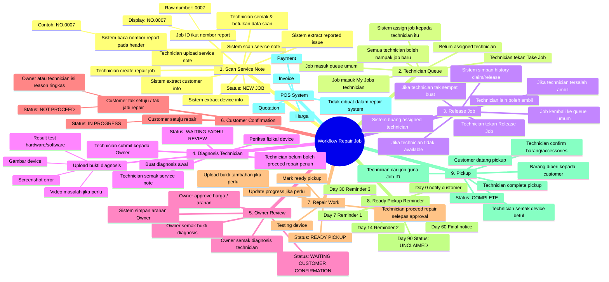
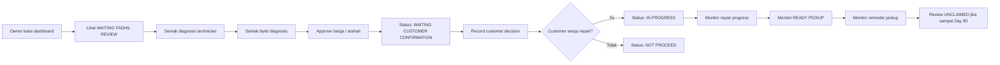
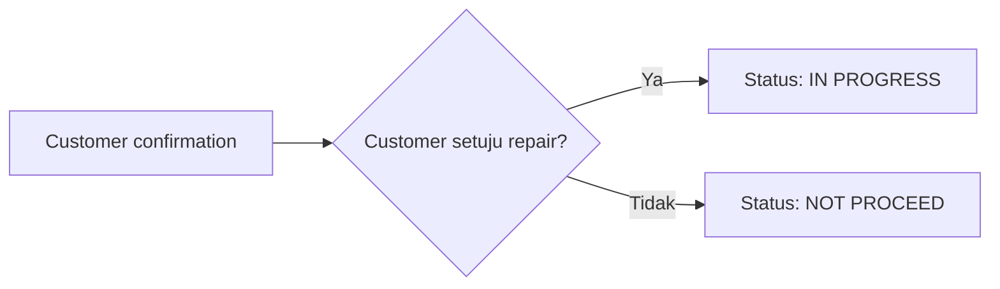

# Repair Workflow

Dokumen ini merekodkan flow kerja yang telah dipersetujui untuk Sistem Autopilot Kedai Komputer Fadhil. Tujuannya ialah supaya flow ini boleh dirujuk semula apabila sistem mahu dikemas kini pada masa akan datang.

## Prinsip Utama

- Sistem hanya menggunakan dua role: Owner/Fadhil dan Technician.
- Technician boleh mula job, scan service note, diagnose, repair, notify pickup, dan complete pickup.
- Owner/Fadhil approve harga/arahan, record customer confirmation, monitor progress, dan decide kes unclaimed.
- Repair system tidak mengurus quotation, invoice, atau payment.
- POS system mengurus harga, quotation, invoice, dan payment.
- Technician tidak boleh proceed repair penuh sebelum Owner approve harga/arahan dan customer setuju repair.
- Job ID diambil daripada nombor service report pada service note, contohnya `NO.0007`.

## Flow Penuh

```mermaid
flowchart LR
    A[Technician scan service note] --> B[Extract service report number]
    B --> C[Job ID = service report number, contoh NO.0007]
    C --> D[Technician semak & betulkan data scan]
    D --> E[Create repair job]
    E --> F[Status: NEW JOB]
    F --> G[Technician Take Job]
    G --> H{Technician boleh handle?}
    H -->|Tidak| I[Release Job]
    I --> F
    H -->|Ya| J[Diagnosis + upload bukti]
    J --> K[Submit kepada Owner]
    K --> L[Status: WAITING FADHIL REVIEW]
    L --> M[Owner review diagnosis]
    M --> N[Owner approve harga / arahan]
    N --> O[Status: WAITING CUSTOMER CONFIRMATION]
    O --> P{Customer setuju repair?}
    P -->|Ya| Q[Status: IN PROGRESS]
    P -->|Tidak| R[Status: NOT PROCEED]
    Q --> S[Technician proceed repair]
    S --> T[Testing device]
    T --> U[Mark ready pickup]
    U --> V[Status: READY PICKUP]
    V --> W[Day 0: Technician notify customer]
    W --> X{Customer datang pickup?}
    X -->|Ya| Y[Technician semak Job ID & device]
    Y --> Z[Complete pickup]
    Z --> AA[Status: COMPLETE]
    AA --> AB[Barang diberi kepada customer]
    X -->|Belum| AC[Day 7 Reminder 1]
    AC --> AD[Day 14 Reminder 2]
    AD --> AE[Day 30 Reminder 3]
    AE --> AF[Day 60 Final notice]
    AF --> AG[Day 90 Status: UNCLAIMED]
    AG --> AH[Owner review & decide next action]
```

## Peta Minda

## Role Flow

### Owner / Fadhil

Owner/Fadhil ialah role untuk approve, decide, dan monitor.

Owner/Fadhil boleh:

- Review diagnosis.
- Semak bukti diagnosis.
- Approve harga/arahan.
- Record customer confirmation.
- Monitor job progress.
- Monitor ready pickup.
- Monitor overdue pickup.
- Decide tindakan untuk `UNCLAIMED`.
- View reports/history.

### Technician

Technician ialah role untuk mula job, diagnose, repair, pickup, dan reminder.

```mermaid
flowchart LR
    A[Customer hantar barang] --> B[Technician scan service note]
    B --> C[Extract service report number]
    C --> D[Job ID ikut NO report]
    D --> E[Technician semak & betulkan data scan]
    E --> F[Create repair job]
    F --> G[Status: NEW JOB]
    G --> H[Take Job]
    H --> I{Boleh handle?}
    I -->|Tidak| J[Release Job]
    J --> G
    I -->|Ya| K[Semak service note]
    K --> L[Periksa fizikal device]
    L --> M[Buat diagnosis awal]
    M --> N[Upload bukti diagnosis]
    N --> O[Submit kepada Owner]
    O --> P[Tunggu Owner + customer confirmation]
    P --> Q{Status IN PROGRESS?}
    Q -->|Ya| R[Proceed repair]
    Q -->|Tidak| S[Stop, NOT PROCEED]
    R --> T[Testing device]
    T --> U[Mark ready pickup]
    U --> V[Notify customer]
    V --> W[Reminder jika belum pickup]
    W --> X[Complete pickup bila customer datang]
```

Technician boleh:

- Scan service note.
- Semak dan betulkan data scan.
- Create repair job.
- Take Job.
- Release Job.
- Diagnosis device.
- Upload bukti.
- Submit kepada Owner.
- Repair selepas approval.
- Update progress.
- Mark ready pickup.
- Notify customer pickup.
- Follow reminder schedule.
- Complete pickup.
- Serah barang kepada customer.

Technician tidak boleh:

- Proceed repair penuh sebelum Owner approve harga/arahan.
- Proceed repair penuh sebelum customer setuju repair.
- Urus quotation, invoice, atau payment dalam repair system.

## Status

| Status | Maksud |
| --- | --- |
| `NEW JOB` | Job baru dicipta daripada service note dan belum selesai diagnosis. |
| `WAITING FADHIL REVIEW` | Technician sudah submit diagnosis dan menunggu Owner review. |
| `WAITING CUSTOMER CONFIRMATION` | Owner sudah approve harga/arahan dan menunggu customer decide. |
| `IN PROGRESS` | Customer setuju repair dan technician boleh proceed repair penuh. |
| `NOT PROCEED` | Customer tak setuju atau tak jadi repair. |
| `READY PICKUP` | Repair/testing siap dan barang boleh diambil customer. |
| `UNCLAIMED` | Barang masih belum diambil selepas reminder sampai Day 90. |
| `COMPLETE` | Barang sudah diserahkan kepada customer dan job selesai. |

## Ready Pickup Reminder Schedule

| Hari | Tindakan |
| --- | --- |
| Day 0 | Notify customer bahawa barang sudah siap untuk pickup. |
| Day 7 | Reminder 1. |
| Day 14 | Reminder 2. |
| Day 30 | Reminder 3. |
| Day 60 | Final notice. |
| Day 90 | Tukar status kepada `UNCLAIMED` dan Owner decide next action. |

## Customer Confirmation

Customer confirmation disederhanakan kepada dua pilihan sahaja:

Jika customer tidak setuju atau tak jadi repair, sistem perlu simpan reason ringkas seperti:

- Harga mahal.
- Customer nak fikir dulu.
- Customer ambil balik barang.
- Device tidak berbaloi repair.
- Part tiada.
- Customer tidak dapat dihubungi.
- Lain-lain.

## Data Penting Pada Job

Setiap job perlu simpan:

- Job ID display, contohnya `NO.0007`.
- Raw report number, contohnya `0007`.
- Customer name.
- Customer phone.
- Device type, brand, model, serial number.
- Reported issue.
- Service note attachment.
- Assigned technician.
- Diagnosis notes.
- Diagnosis evidence.
- Owner instruction.
- Customer confirmation result.
- Ready pickup date.
- Reminder history.
- Pickup completion record.
- Status history.

## Perkara Yang Tidak Dibuat Dalam Repair System

Perkara ini kekal di POS system:

- Harga rasmi.
- Quotation.
- Invoice.
- Payment.
- Payment proof.

Repair system hanya track operasi repair:

- Job.
- Diagnosis.
- Bukti.
- Arahan Owner.
- Status.
- Reminder.
- Pickup.
- History.
